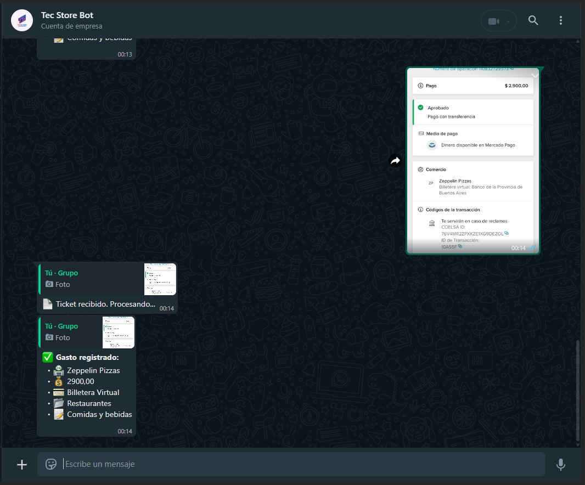
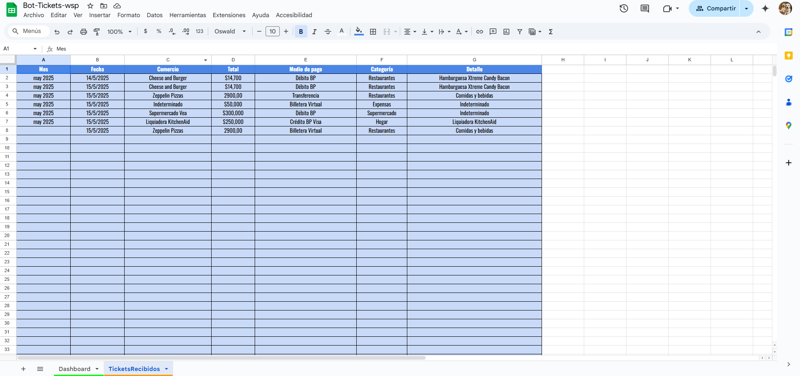
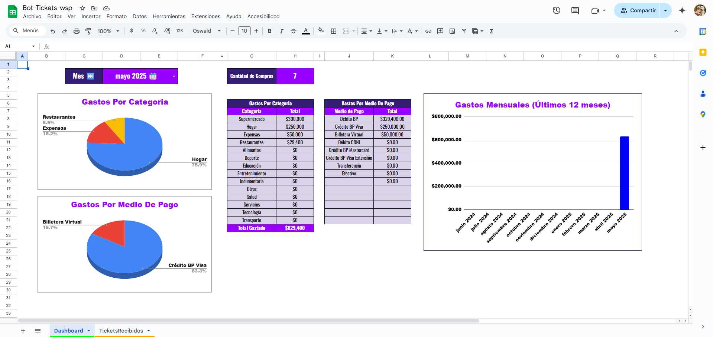

# 🧾 WhatsApp Ticket Bot – Registro automático de gastos

Este proyecto es una herramienta personal creada para registrar automáticamente **gastos diarios** enviados por WhatsApp. A través de una combinación de **OCR (reconocimiento de texto en imágenes)** e **IA semántica**, el bot interpreta tanto imágenes de tickets como mensajes de texto plano, y registra los datos estructurados en una hoja de cálculo de Google Sheets.

---

## 🎯 Motivación

Cargar gastos manualmente en una planilla todos los días es tedioso. Quería una forma más fluida, rápida y natural de registrar mis compras diarias. ¿La solución? Mandar un mensaje o una foto al bot por WhatsApp, y que se encargue del resto.

Así nació este bot como un proyecto 100% personal, con el objetivo de:

- Evitar el ingreso manual de datos
- Registrar todo de forma estructurada
- Poder generar dashboards y análisis automáticos desde Google Sheets

---

## 🛠️ Cómo funciona

1. Enviás un mensaje de WhatsApp con:
   - 📷 Una **foto de un ticket de compra**
   - ✍️ O un **mensaje de texto** como:
     ```
     supermercado 5400 efectivo
     ```

2. El bot recibe ese mensaje:
   - Si es imagen: usa **Tesseract.js** para leer el contenido
   - Luego pasa el texto (extraído o directo) a **Google Gemini**, que interpreta:
     - Monto
     - Comercio
     - Medio de pago
     - Categoría
     - Detalles adicionales (si los hay)

3. Finalmente:
   - Los datos se cargan en **Google Sheets** con fecha y hora
   - Si había un texto adicional, también se guarda como “detalle”
   - Si el ticket no es válido, el bot devuelve un mensaje de error amigable

---

## 🖼️ Vista general

### 🎥 Flujo completo

<p align="center">
  
</p>

### 📄 Ejemplo de mensaje de texto procesado

<p align="center">
  
</p>

### 📊 Registro en Google Sheets

<p align="center">
  
</p>

### 📈 Dashboard de análisis

<p align="center">
  
</p>

---

## 💡 Casos de uso reales

Este bot lo uso todos los días para registrar gastos de todo tipo: supermercado, delivery, transporte, ferretería, salud, etc.

Algunos ejemplos de entradas:

verdulería 3000 efectivo
farmacia 2800 visa débito
pollajería 5400 cuenta dni


Y también imágenes de tickets, como los que recibís al hacer una compra en almacenes o supermercados.

---

## 🧠 Tecnologías utilizadas

- **[whatsapp-web.js](https://github.com/pedroslopez/whatsapp-web.js)** – Conexión al WhatsApp
- **Tesseract.js** – Lectura OCR para extraer texto de tickets en imagen
- **Google Gemini (API)** – Para interpretar semánticamente texto libre (categoría, medio de pago, etc.)
- **Google Sheets API** – Para registrar la información en una planilla automáticamente
- **Node.js** – Backend del bot
- **Railway** – Deploy en la nube para que el bot esté activo 24/7

---

## 🚧 Estado actual

✅ En uso personal desde 2025  
🔒 Proyecto privado (el código no se encuentra público)  
📈 Conectado a un dashboard de Google Sheets con estadísticas en tiempo real

---

## ✨ Posibles mejoras

- Registro multiusuario con autenticación
- Botón "editar gasto" desde WhatsApp
- Envío de resumen semanal automático
- Exportación a PDF / Excel mensual

---

> 💬 *"Automatizar gastos fue un cambio clave para tener control real de mis finanzas personales."*
